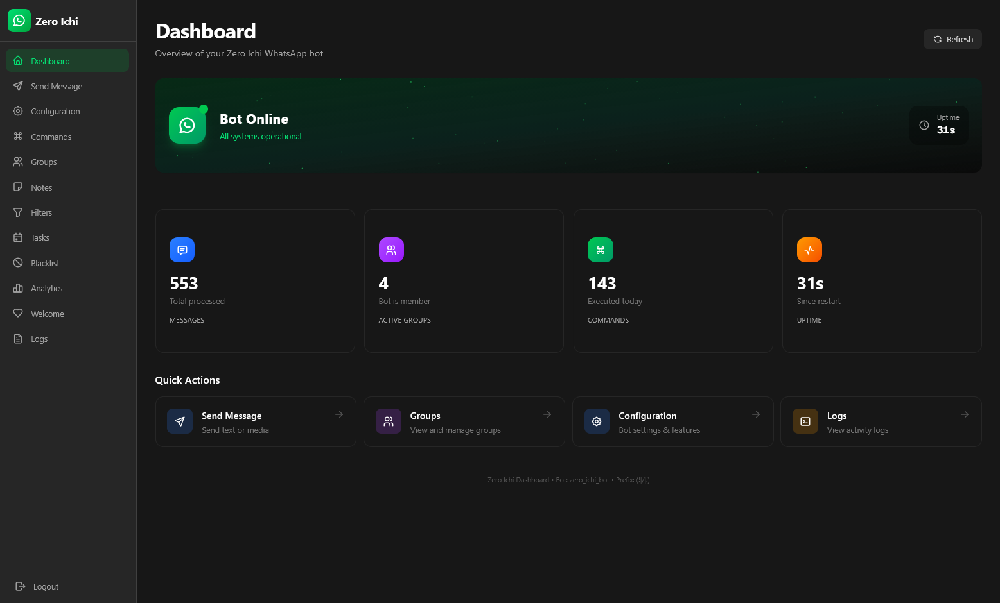

<h1 align="center">Zero Ichi</h1>

<p align="center">
  
</p>

<p align="center">
  A WhatsApp bot built with <a href="https://github.com/krypton-byte/neonize">Neonize</a>
</p>

---

## Table of Contents

- [Requirements](#requirements)
- [Installation](#installation)
- [Running the Bot](#running-the-bot)
- [Configuration](#configuration)
- [Commands](#commands)
- [Features](#features)
- [Agentic AI](#agentic-ai)
- [Adding Custom Commands](#adding-custom-commands)
- [Dashboard](#dashboard)
- [Development](#development)

---

## Requirements

- Python 3.11+
- [uv](https://github.com/astral-sh/uv)
- Node.js 20+ (for dashboard)

---

## Installation

```bash
pip install uv

git clone https://github.com/MhankBarBar/zero-ichi
cd zero-ichi
uv sync
```

<p align="right"><a href="#zero-ichi">back to top</a></p>

---

## Running the Bot

```bash
uv run main.py
```

**First-time setup:**

1. A QR code will appear in the terminal
2. Open WhatsApp on your phone
3. Go to **Settings > Linked Devices > Link a Device**
4. Scan the QR code
<p align="right"><a href="#zero-ichi">back to top</a></p>

---

## Configuration

The bot uses `config.json` with [JSON Schema](https://json-schema.org/) validation for autocomplete and validation.

<details>
<summary><strong>Quick Setup</strong></summary>

```json
{
  "$schema": "./config.schema.json",
  "bot": {
    "name": "my_bot",
    "prefix": "/",
    "login_method": "qr"
  }
}
```

</details>

<details>
<summary><strong>Key Options</strong></summary>

| Option | Default | Description |
|--------|---------|-------------|
| `bot.name` | `zero_ichi_bot` | Session identifier (database filename) |
| `bot.prefix` | `/` | Command prefix (supports regex) |
| `bot.login_method` | `qr` | Login method: `qr` or `phone` |
| `bot.owner_jid` | — | Bot owner's JID |

</details>

<details>
<summary><strong>Environment Variables</strong></summary>

Store sensitive config in `.env`:

```bash
AI_API_KEY=your_openai_api_key_here
```

Copy `.env.example` to `.env` and fill in your values.

</details>

**Set yourself as owner:** `/config owner me`

<p align="right"><a href="#zero-ichi">back to top</a></p>

---

## Commands

<details>
<summary><strong>General</strong></summary>

| Command | Description |
|---------|-------------|
| `/help` | Show all commands |
| `/ping` | Check bot latency |
| `/menu` | Show command menu |

</details>

<details>
<summary><strong>Admin (Group Only)</strong></summary>

| Command | Description |
|---------|-------------|
| `/kick @user` | Kick a user |
| `/add <number>` | Add user to group |
| `/mute @user` | Mute a user |
| `/unmute @user` | Unmute a user |
| `/promote @user` | Promote to admin |
| `/demote @user` | Demote from admin |
| `/admins` | List group admins |

</details>

<details>
<summary><strong>Group Management</strong></summary>

| Command | Description |
|---------|-------------|
| `/invite` | Get group invite link |
| `/revoke` | Revoke invite link |
| `/groupinfo` | Show group information |
| `/setname <name>` | Change group name |
| `/setdesc <desc>` | Change group description |
| `/tagall [msg]` | Mention all members |

</details>

<details>
<summary><strong>Content</strong></summary>

| Command | Description |
|---------|-------------|
| `/save <name> <text>` | Save a note |
| `/notes` | List saved notes |
| `/clear <name>` | Delete a note |
| `/filter <trigger> <response>` | Create auto-reply |
| `/filters` | List all filters |
| `/stop <trigger>` | Remove a filter |
| `/sticker` | Convert image to sticker |

</details>

<details>
<summary><strong>Moderation</strong></summary>

| Command | Description |
|---------|-------------|
| `/warn @user [reason]` | Warn a user |
| `/warns @user` | Check user warnings |
| `/resetwarns @user` | Clear warnings |
| `/blacklist <word>` | Add word to blacklist |
| `/antilink` | Configure anti-link |

</details>

<details>
<summary><strong>Owner Only</strong></summary>

| Command | Description |
|---------|-------------|
| `/config` | Manage bot configuration |
| `/config ai` | Configure agentic AI |
| `/antidelete` | Toggle/configure anti-delete |
| `/eval <code>` | Execute Python code |
| `/aeval <code>` | Execute async Python code |
| `/addcommand` | Add command via code |
| `/delcommand <name>` | Delete dynamic command |
| `/listdynamic` | List dynamic commands |

</details>

<p align="right"><a href="#zero-ichi">back to top</a></p>

---

## Features

<details>
<summary><strong>Anti-Delete</strong></summary>

Reveals deleted messages by re-sending them.

```
/antidelete on
/antidelete forward me
```

</details>

<details>
<summary><strong>Notes System</strong></summary>

Save and retrieve text/media notes using `#notename`:

```
/save greeting Hello, welcome!
#greeting  ->  "Hello, welcome!"
```

</details>

<details>
<summary><strong>Filters</strong></summary>

Auto-reply when specific words are detected:

```
/filter hello Hi there!
```

</details>

<details>
<summary><strong>Blacklist</strong></summary>

Auto-delete messages containing blacklisted words:

```
/blacklist badword
```

</details>

<details>
<summary><strong>Anti-Link</strong></summary>

Detect and handle links in group chats:

```
/antilink on
/antilink action delete
/antilink whitelist add youtube.com
```

</details>

<details>
<summary><strong>Warnings</strong></summary>

Warn users with configurable limits and actions:

```
/warn @user Spamming
/warnconfig limit 5
/warnconfig action kick
```

</details>

<p align="right"><a href="#zero-ichi">back to top</a></p>

---

## Agentic AI

The bot includes an AI assistant powered by OpenAI (or other providers). The AI can process messages and execute bot commands on your behalf.

### Configuration

Set your API key in `.env`:

```bash
AI_API_KEY=sk-your-openai-key
```

Configure via WhatsApp:

```
/config ai              # Show AI status
/config ai on           # Enable AI
/config ai off          # Disable AI
/config ai mode reply   # Trigger modes: always, mention, reply
```

| Mode | Description |
|------|-------------|
| `always` | AI responds to every message |
| `mention` | AI responds when mentioned |
| `reply` | AI responds when replying to bot |

<p align="right"><a href="#zero-ichi">back to top</a></p>

---

## Adding Custom Commands

<details>
<summary><strong>Method 1: Create a File</strong></summary>

Create `commands/<category>/<name>.py`:

```python
from core.command import Command, CommandContext

class HelloCommand(Command):
    name = "hello"
    description = "Say hello"
    usage = "/hello"
    
    async def execute(self, ctx: CommandContext) -> None:
        await ctx.client.reply(ctx.message, "Hello!")
```

</details>

<details>
<summary><strong>Method 2: Dynamic Command (Owner Only)</strong></summary>

Send via WhatsApp:

```
/addcommand
from core.command import Command, CommandContext

class GreetCommand(Command):
    name = "greet"
    description = "Greet someone"
    usage = "/greet"
    
    async def execute(self, ctx):
        await ctx.client.reply(ctx.message, "Greetings!")
```

</details>

<p align="right"><a href="#zero-ichi">back to top</a></p>

---

## Dashboard

Web dashboard for administration. See the [dashboard README](dashboard/README.md) for details.



```bash
# Terminal 1: Start the bot
uv run main.py

# Terminal 2: Start the dashboard
cd dashboard && bun dev
```

Open `http://localhost:3000`

<p align="right"><a href="#zero-ichi">back to top</a></p>

---

## Development

<details>
<summary><strong>Commands</strong></summary>

```bash
uv run ruff format .    # Format code
uv run ruff check .     # Lint check
```

</details>

<details>
<summary><strong>Project Structure</strong></summary>

```
zero-ichi/
├── main.py             # Main entry point
├── dashboard_api.py    # FastAPI backend
├── config.json         # Bot configuration
├── commands/           # Command modules
├── core/               # Core modules
├── dashboard/          # Next.js admin dashboard
├── data/               # Per-group data storage
└── logs/               # Log files
```

</details>

<p align="right"><a href="#zero-ichi">back to top</a></p>

