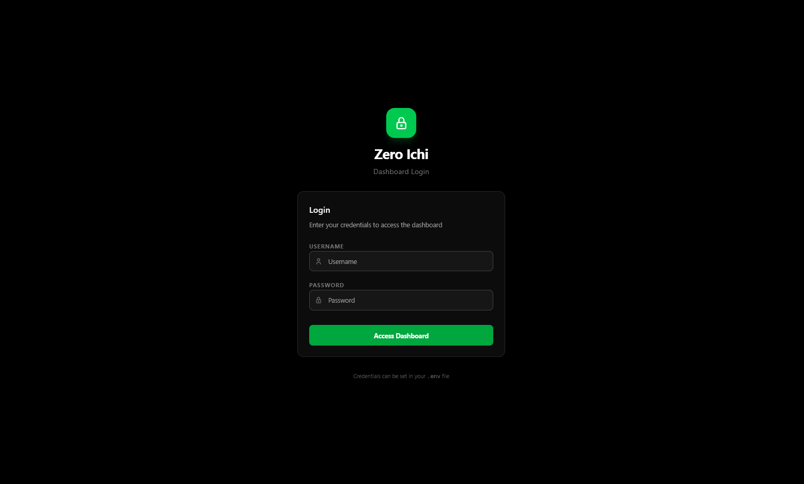
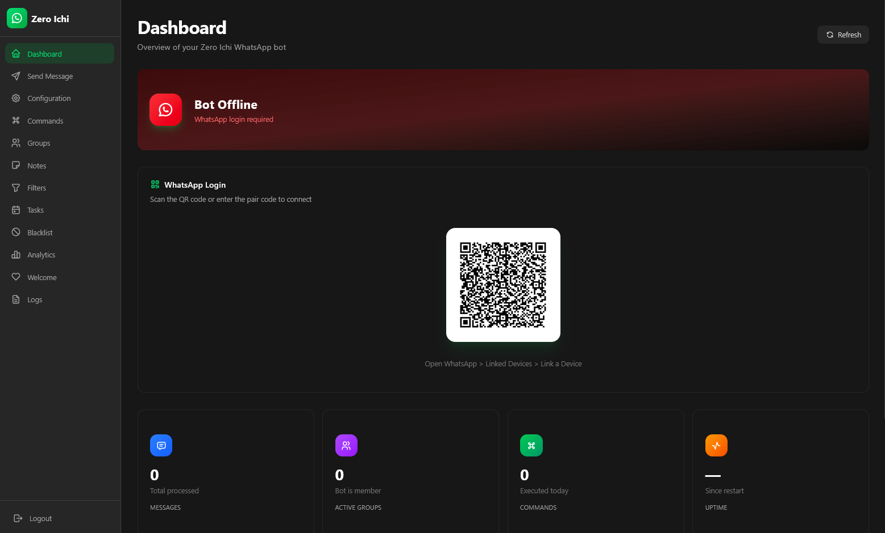
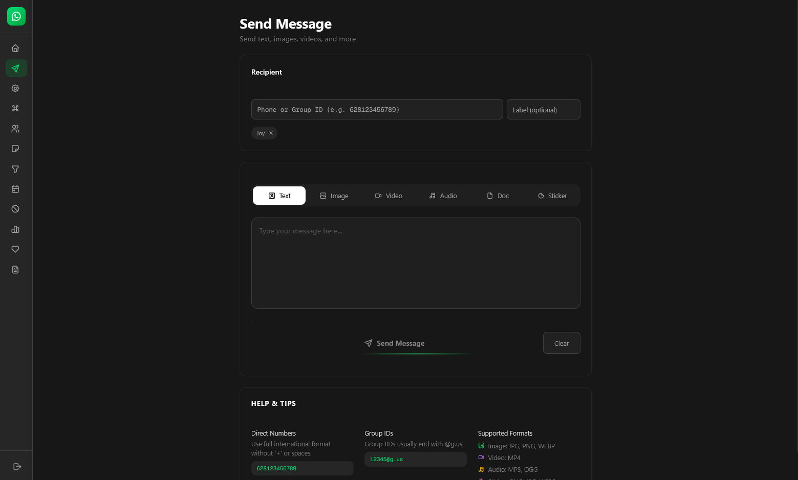

# Zero Ichi Dashboard

A modern admin dashboard for the Zero Ichi WhatsApp Bot. Built with Next.js.

---

## Overview

The dashboard provides a web-based interface for managing and monitoring the Zero Ichi bot. It connects to the bot's API to display statistics, configure settings, manage commands, and view logs.

---

## Screenshots

| Dashboard                          | Login                                |
| ---------------------------------- | ------------------------------------ |
|  |  |

| QR Login                         |
| -------------------------------- |
|  |

| Send Message                             |
| ---------------------------------------- |
|  |

---

## Getting Started

### Prerequisites

- Node.js 20+
- The bot API running on `http://localhost:8000`

### Installation

```bash
# Navigate to dashboard directory
cd dashboard

# Install dependencies (using Bun)
bun install

# Or using npm
npm install
```

### Development

```bash
# Start development server
bun dev

# Or using npm
npm run dev
```

Open [http://localhost:3000](http://localhost:3000) in your browser.

### Production Build

```bash
# Build for production
bun run build

# Start production server
bun start
```

---

## Project Structure

```
dashboard/
├── src/
│   ├── app/              # Next.js App Router pages
│   │   ├── page.tsx      # Dashboard home
│   │   └── layout.tsx    # Root layout
│   ├── components/       # Reusable UI components
│   │   ├── ui/           # Base UI primitives
│   │   └── ...           # Feature components
│   └── lib/              # Utility functions
├── public/               # Static assets
├── package.json          # Dependencies
└── tailwind.config.ts    # Tailwind configuration
```

---

## Features

| Feature         | Description                        |
| --------------- | ---------------------------------- |
| Status Overview | Real-time bot status and uptime    |
| Statistics      | Message and command usage metrics  |
| Command Manager | Enable/disable commands at runtime |
| Group Manager   | Configure per-group settings       |
| Configuration   | Modify bot settings via UI         |
| Task Scheduler  | View and manage scheduled tasks    |
| Logs Viewer     | Browse recent bot activity         |

---

## API Connection

The dashboard expects the bot API to be running at `http://localhost:8000`. The API is started automatically when running the bot via `uv run main.py`.

| Endpoint            | Description             |
| ------------------- | ----------------------- |
| `GET /api/status`   | Bot status and uptime   |
| `GET /api/stats`    | Usage statistics        |
| `GET /api/commands` | Command list and status |
| `GET /api/groups`   | Joined groups           |
| `GET /api/config`   | Current configuration   |
| `PUT /api/config`   | Update configuration    |
| `GET /api/tasks`    | Scheduled tasks         |
| `GET /api/logs`     | Recent logs             |
