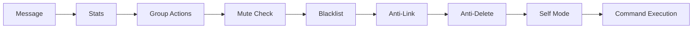

# Architecture

Overview of Zero Ichi's internal architecture and project structure.

## Project Structure

```
zero-ichi/
├── main.py                     # Entry point wrapper (delegates to src/main.py)
├── config.json                 # Bot configuration
├── config.schema.json          # JSON Schema for validation
├── pyproject.toml              # Project metadata, dependencies, scripts
│
├── src/                        # Application source
│   ├── main.py                 # Core entry point, message handler
│   ├── dashboard_api.py        # FastAPI dashboard backend
│   │
│   ├── ai/                     # Agentic AI module
│   │   ├── agent.py            # Main AI agent logic
│   │   ├── config.py           # AI configuration
│   │   ├── context.py          # Message context builder
│   │   ├── memory.py           # Conversation memory
│   │   ├── skills.py           # Skill management
│   │   └── tools/              # AI tool definitions
│   │
│   ├── commands/               # Command modules (auto-discovered)
│   │   ├── admin/
│   │   ├── content/
│   │   ├── downloader/
│   │   ├── fun/
│   │   ├── general/
│   │   ├── group/
│   │   ├── moderation/
│   │   ├── owner/
│   │   └── utility/
│   │
│   ├── config/                 # Configuration loading
│   │   └── settings.py         # Static settings from config.json
│   │
│   ├── core/                   # Core modules
│   │   ├── client.py           # WhatsApp client wrapper
│   │   ├── command.py          # Command base class & loader
│   │   ├── constants.py        # Project constants
│   │   ├── downloader.py       # Media downloader logic
│   │   ├── errors.py           # Error handling utilities
│   │   ├── event_bus.py        # Event system
│   │   ├── i18n.py             # Internationalization
│   │   ├── jid_resolver.py     # JID / LID resolution
│   │   ├── logger.py           # Logging utility (Rich-based)
│   │   ├── message.py          # Message helper class
│   │   ├── middleware.py       # Middleware base class
│   │   ├── middlewares/        # Middleware implementations
│   │   ├── permissions.py      # Permission checks
│   │   ├── rate_limiter.py     # Rate limiting
│   │   ├── runtime_config.py   # Live configuration manager
│   │   ├── scheduler.py        # Task scheduler
│   │   ├── storage.py          # Per-group data storage
│   │   ├── symbols.py          # Unicode symbols
│   │   └── handlers/           # Event handlers
│   │
│   └── locales/                # Translation files (en, id)
│
├── dashboard/                  # Next.js admin dashboard
├── data/                       # Per-group persistent data
└── logs/                       # Log files
```

## Core Modules

### Message Flow

```
WhatsApp -> Neonize -> src/main.py -> Middleware Pipeline -> Command Loader -> Command.execute()
```

1. **Neonize** receives the WhatsApp message
2. **`src/main.py`** wraps it in a `MessageHelper` and passes it through the middleware pipeline
3. **Middleware** runs in sequence (stats, group actions, mute check, blacklist, anti-link, anti-delete, self mode)
4. **Command Loader** matches the prefix + command name
5. **Permissions** are checked (admin, owner, bot-admin, rate limit)
6. **Command.execute()** runs the command logic

### Middleware Pipeline

Zero Ichi uses a middleware pipeline to process messages before command execution.



Each middleware can modify the message context or stop processing (e.g., if a user is muted or blacklisted).

### Event System

The bot uses an event-driven architecture for features like:

-   **`on_message`** — Triggered for every incoming message.
-   **`on_group_participant_update`** — Welcome/Goodbye messages.
-   **`on_call`** — Auto-reject calls (optional).

Handlers are registered in `src/core/handlers/` and loaded by `src/main.py`.

### Command System

Commands are Python classes that inherit from `Command`:

```python
class Command:
    name: str               # Command name
    aliases: list[str]      # Alternative names
    description: str        # Help text
    usage: str              # Usage example
    group_only: bool        # Group-only command
    private_only: bool      # DM-only command
    admin_only: bool        # Requires group admin
    owner_only: bool        # Requires bot owner
    bot_admin_required: bool  # Bot must be group admin
    cooldown: int           # Seconds between uses
```

Commands are auto-discovered from `src/commands/*/` directories.

### Storage

`core/storage.py` provides per-group persistent storage using JSON files in the `data/` directory:

```python
from core.storage import GroupData

storage = GroupData(chat_jid)
storage.save("rules", {"text": "Be kind!"})
rules = storage.load("rules", {"text": ""})
```

### JID Resolver

WhatsApp uses two ID formats: **PN** (phone number) and **LID** (linked ID). The JID resolver handles conversion between them:

```python
from core.jid_resolver import jids_match, resolve_pair

if await jids_match(jid1, jid2, client):
    print("Same user!")
```
